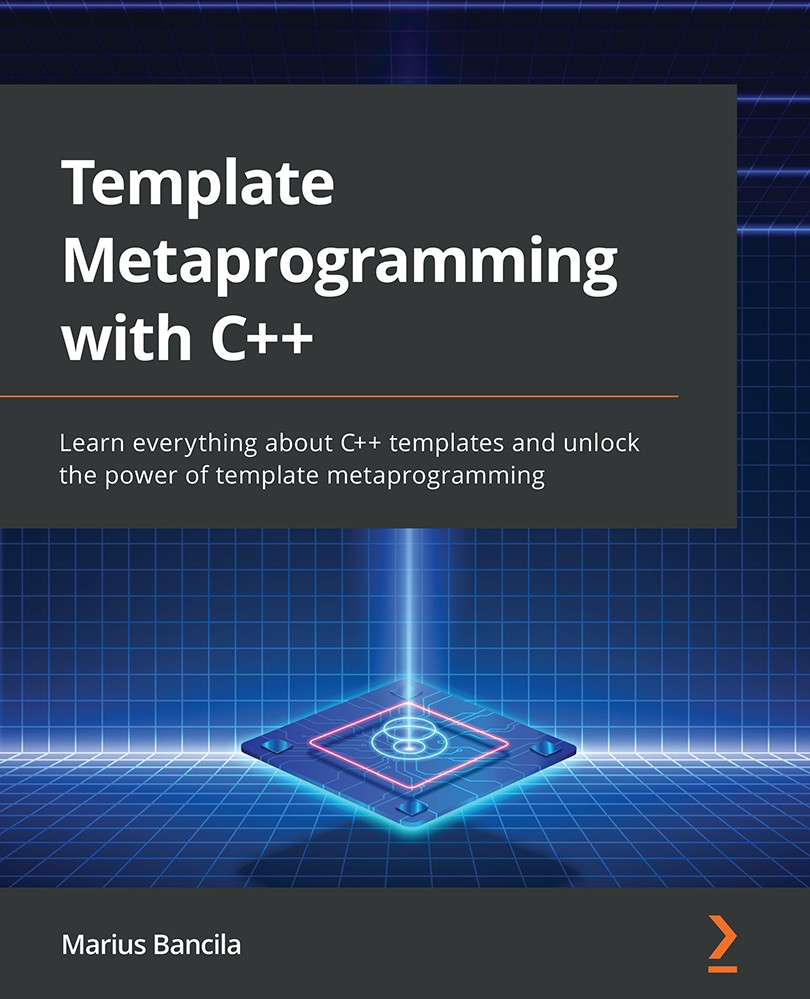

# Template Metaprogramming with C++  

*Learn everything about C++ templates and unlock the power of template metaprogramming*

*详细的了解C++模板，释放模板元编程的力量*

 

* 作者：Marius Bancila   
* 译者：陈晓伟
* 首次发布时间：2022年8月29日([来源](https://www.amazon.sg/Template-Metaprogramming-template-metaprogramming-efficient/dp/1803243457/ref=sr_1_1?keywords=Template+Metaprogramming+with+C%2B%2B&qid=1671973833&sr=8-1))

> 翻译是译者用自己的思想，换一种语言，对原作者想法的重新阐释。鉴于我的学识所限，误解和错译在所难免。如果你能买到本书的原版，且有能力阅读英文，请直接去读原文。因为与之相较，我的译文可能根本不值得一读。
>
> 
 — 云风，程序员修炼之道第2版译者

PDF可在本库的[Release页面](https://github.com/xiaoweiChen/Template-Metaprogramming-with-CPP/releases)获取。

## 本书概述

了解元编程，可以创建在编译时进行计算的数据结构和函数。本书将带您了解如何使用模板避免编写重复的代码，以及其为什么会成为通用库(如标准库或Boost)的关键(通用库可用于很多程序中)。

本书将深入了解模板和元编程的基础知识，再练习编写复杂的模板，并探索高级概念，如模板递归、模板参数推导、转发引用、类型特征和条件编译。这个过程中，将了解如何编写可变参数模板，以及如何使用C++20约束和概念为模板参数进行限制。最后，可以使用C++元编程模板来实现各种元编程模式。

本书的最后，将学习如何在日常编程中编写有效的模板和实现元编程。

#### 关键特性

- 了解C++20的最新特性，并使用STL编写更好的代码

- 减少应用程序的开发时间，可以更快的进行部署
- 使用最新标准中引入的新而精简的STL功能

#### 将会学到

- 类型模板的语法

- 特化和实例化如何工作

- 模板参数推断和转发引用

- 编写可变参数见模板

- 熟悉类型特征和条件编译

- 用约束和概念限制C++20中的模板参数

- 实现CRTP、Mixins和标签分派等模式

  

## 适读人群

这本书是为初学者到中级C++开发人员(想要学习和了解模板元编程的人员)，以及高级C++开发人员(希望了解与模板相关的新C++20特性和各种习语和模式)。阅读这本书之前，需要有基本的C++编程经验。

## 作者简介

Marius Bancila是一名软件工程师，为工业和金融部门开发解决方案方面，拥有近20年的经验。他是《现代C++挑战》的作者和《学习C\#编程》的合著者。并且是一名软件架构师，专注于Microsoft技术，主要使用C++和C\#开发桌面应用程序。热衷于分享其技术专长，自2006年以来，他一直是微软C++和开发人员眼中的技术MVP。Marius住在罗马尼亚，并且活跃在各种网络社区

## 本书相关

* github地址：https://github.com/xiaoweiChen/Template-Metaprogramming-with-CPP
* 译文的LaTeX 环境配置：https://www.cnblogs.com/1625--H/p/11524968.html 
  * 禁用拼写检查：https://blog.csdn.net/weixin_39278265/article/details/87931348

* vscode中配置latex：https://blog.csdn.net/Ruins_LEE/article/details/123555016
* 原书示例：https://github.com/PacktPublishing/Template-Metaprogramming-with-CPP

